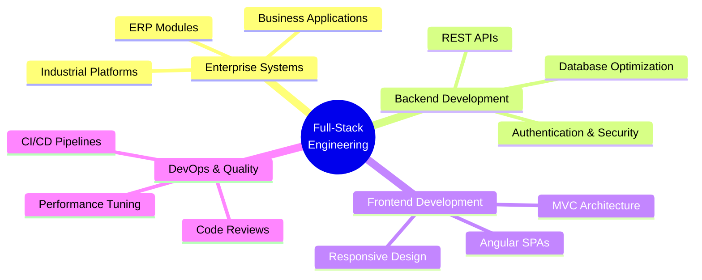

# 👋 Hi, I'm Fahad Iqbal

### Full-Stack Software Engineer | .NET • Angular • Enterprise & Industrial Systems

---

## 🚀 About Me

I'm a **Full-Stack Software Engineer** specializing in building **production-grade enterprise and industrial systems** that power real-world operations.

### 💼 What I Build:
- ✅ **Enterprise Web Applications**
- ✅ **Industrial Operations Platforms**
- ✅ **Business Management Systems**
- ✅ **Secure REST APIs**
- ✅ **Real-Time Monitoring Dashboards**

### 🛠️ Tech Stack:
- **Backend:** .NET Core, ASP.NET MVC, Entity Framework
- **Frontend:** Angular, TypeScript, JavaScript
- **Databases:** SQL Server, Oracle PL/SQL
- **Tools:** Azure, ThingsBoard, Git, Jira

 

---

## 🏭 Industrial Systems Portfolio

I've built **production-critical systems** for major manufacturing and industrial operations:

<table>
<tr>
<td width="50%">

### 🏢 Manufacturing & Production
- **Treet Corporation** - Blades Manufacturing
- **Pepsi Pakistan** - Beverage Plant Operations
- **Service Tyre Industries** - Industrial Management
- **Mezan Group (Cola Next)** - Beverage Production
- **Cement Manufacturing** - Machine-Integrated Systems

</td>
<td width="50%">

### ⚙️ System Features
- 📊 Real-time production monitoring
- 🔒 Role-based access control
- 📈 High-volume data reporting
- 🏭 Machine-connected data collection
- 🎯 Operations visibility dashboards

</td>
</tr>
</table>

---

## 💻 Technology Stack

### Backend & APIs

### Frontend

### Databases

### DevOps & Tools

---

## 🎯 Core Specializations

---

## 🎓 Education

**🎓 Bachelor of Science in Computer Science**  
HITEC University (2020 – 2024)

- Software Engineering & Architecture
- Algorithms & Data Structures
- Software Quality Assurance
- System Design & Testing

---

## 💡 Professional Philosophy

| 🎯 Principle | 📝 Approach |
|-------------|------------|
| **Code Quality** | Clean, maintainable, scalable architecture |
| **Business Impact** | Solutions driven by real-world needs |
| **Security First** | Built-in security from ground up |
| **Reliability** | Production-tested, long-term stability |
| **Growth Mindset** | Continuous learning & innovation |

---

## 🤝 Let's Connect

---

### ⭐ Open to Enterprise Systems | Product Development | Industrial Platforms | High-Impact Collaborations

